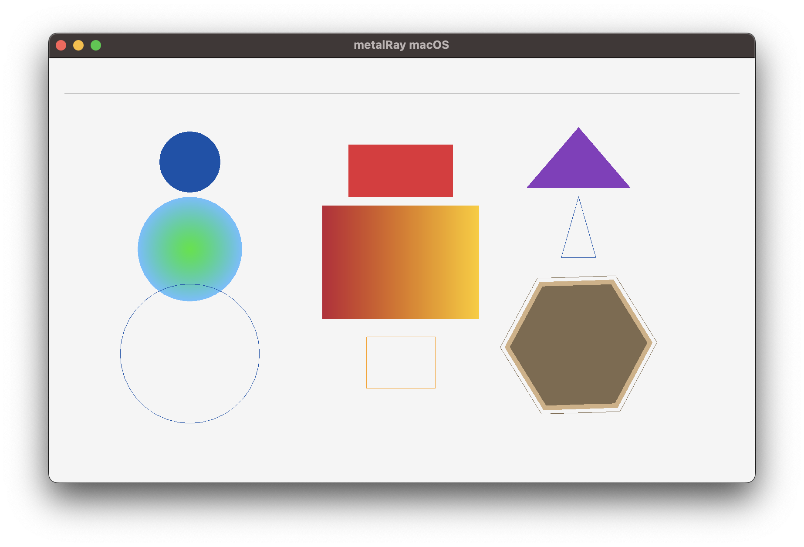

## metalRay

**metalRay** is an ongoing effort to create a game framework for the Apple ecosystem supporting both the Swift and C programming languages. While the C version is compatible with the popular [raylib](https://raylib.com) library.

All drawing is done natively in Metal. Existing *raylib* games need only very minor modifications to run in Metal while being able to be deployed easily to macOS, iOS and tvOS (Note that only a small subset of the *raylib* library is supported right now, this will grow over time).

*metalRay* focuses right now on 2D drawing, 3D support will be integrated once 2D is stable.

## How to use

Fork this repository and open the Xcode project. The Swift based game can be found inside the **GameSwift** folder, the C based game in the **GameC** folder.

You can either use Swift or C or mix both.

The Xcode project contains targets for macOS, iOS and tvOS.

I will soon add some Swift and C examples to the project.

## Status

Most of the basic shape drawing is done, next will be text / textures and shaders.

I will probably not port most of the raylib Window initialization / manipulation functions as Xcode should be used to setup the project. Also most of them would not have any meaning on iOS / tvOS anyway.

However all information gathering functions like *GetScreenWidth* etc. are of course supported.

## Disclaimer

metalRay is licensed under the zlib license and uses algorithms and code from [raylib](https://raylib.com) to recreate the raylib API, as indicated in the code.

